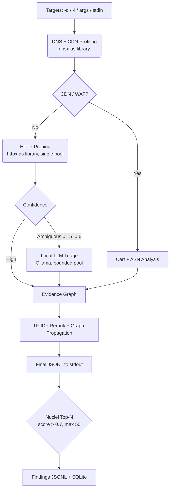

# Project Argus

Campaign-aware offensive-security recon triage. Out of 5,000 subdomains, which 15 are actually worth your time?

Argus probes targets (embedded `httpx`/`dnsx` engines — no CLI wrappers), scores every host with **campaign-aware TF-IDF rarity**, fuses evidence through an **in-memory graph**, resolves ambiguous pages with a **local LLM**, and post-scans the Top-N with **nuclei exposure/misconfiguration templates**. Output is strict JSONL on stdout for Unix pipelines; everything human-readable goes to stderr.

## Pipeline



## Installation

**Binary release** (Linux, macOS, Windows — amd64/arm64): download from the Releases page, or build with [GoReleaser](https://goreleaser.com/) via `make snapshot` (outputs to `dist/`).

**From source** (Go ≥ 1.26):

```bash
go install github.com/argus/argus/cmd/argus@latest
# or
git clone https://github.com/argus/argus && cd argus && make build
```

First nuclei run downloads the template bundle (`~/.nuclei`); offline runs degrade gracefully to zero findings.

## Usage

### scan — probe, score, stream

```bash
# Bring your own subdomains (amass/subfinder paste-friendly: comments, raw URLs)
argus scan -l subs.txt --profile standard | tee verdicts.jsonl

# Stealth profile: passive pace, no LLM, no headless
argus scan -d target.com --profile stealth | nuclei -tags exposure

# Live-fire tuning dump (token sketches, df table, ambiguity-band flags)
argus scan -l subs.txt --export-corpus corpus.json

# Nuclei post-step tuning
argus scan -l subs.txt --nuclei-min-score 0.7 --nuclei-max-hosts 50 \
  --nuclei-timeout 10m --nuclei-tags exposure,misconfig
```

stdout carries two line types only: provisional verdicts (`"final":false`) during
probing, reranked finals (`"final":true`) after the TF-IDF pass, then
`{"type":"nuclei_finding",...}` lines. Split them deterministically:

```bash
argus scan -l subs.txt | jq -c 'select(.type=="nuclei_finding")'
```

Interrupted 10-hour scans resume exactly: `argus scan -l subs.txt --db argus.db --campaign target.com`.

### filter — slice persisted verdicts

```bash
argus filter --min-score 0.6 --format urls > top_targets.txt
argus filter --tech Jenkins --format jsonl
argus filter --campaign target.com --min-confidence 0.8 --format markdown
argus filter --tech jenkins,express --limit 20 --format urls
```

Formats: `urls` (pipe-ready), `jsonl` (full verdicts), `markdown` (notes table).
Tech matching is case-insensitive substring OR; all SQL is parameterized.

### export — render the attack surface

```bash
argus export --campaign target.com --format dot --out surface.dot
dot -Tpng surface.dot -o surface.png
argus export --format mermaid   # paste into GitHub Markdown
```

### ui — local triage dashboard

```bash
argus ui --port 8080 --open
```

Single-binary server (embedded templates, vanilla JS/CSS, no build step): a
Mermaid **Graph** view with click-to-inspect side panel (Score, Rarity,
Evidence, Headers, Nuclei findings) and a sortable/filterable **Corpus** view
highlighting the 0.15–0.6 ambiguity band. Binds `127.0.0.1` only.

### db — resume store management

```bash
argus db stats                          # per-campaign tasks/nodes/edges/results
argus db reset --campaign target.com    # wipe one campaign
argus db reset --all
```

## Scoring: TF-IDF Rarity

Static keyword scoring fails against real infrastructure: when Cloudflare puts
a 403 on 800 hosts, `+10 for 403` ranks all 800 "high priority". Argus instead
computes Inverse Document Frequency **per campaign**:

```
IDF(t) = log(1 + N / (1 + df(t)))
```

Tokens on >70% of hosts (WAF markers, `Server: cloudflare`) are crushed ×0.1;
tokens on 2 hosts (`X-Debug-Token`, `Laravel-Debug`) skyrocket. The final score
is an additive, capped, explainable blend:

```
score = min(1, rarity_norm + login/admin/debug/api bonuses) × confidence
```

- **Deduplication first:** SimHash + favicon + status + title clustering hides
  50 identical WAF pages behind one representative.
- **Confidence multipliers:** `admin` alone is 0.3; `admin` + login title +
  password input + known favicon reaches 0.95. Correlated signals add, never
  multiply.
- **Graph propagation:** interest flows through shared IPs/certs (BFS, decay
  0.5, depth ≤ 3, cycle-safe), so a boring API host linked to a juicy staging
  cert rises.

## Local LLM integration

Hosts scoring in the **[0.15, 0.6) ambiguity band** are sent to a bounded
4-worker pool targeting local Ollama (`/api/chat`, default `llama3.1:8b`).
The system prompt enforces a closed taxonomy with strict-JSON output:

- `WAF_BLOCK`, `PARKED`, `GENERIC_ERROR` (confidence ≥ 0.7) → score ×0.5
- `UNIQUE_APP`, `ADMIN_PANEL` (confidence ≥ 0.7) → score +0.2×confidence
- `UNKNOWN`, degraded, or low confidence → score untouched, verdict recorded

High-confidence regex matches bypass the LLM for speed; `--profile stealth`
and `--ollama=` disable it entirely. Ollama unreachable, slow, or
unparseable → degraded `UNKNOWN`, pipeline never crashes.

## Nuclei Top-N (bounty-safe)

After scoring, hosts above `--nuclei-min-score` (default 0.7, max 50) run the
`nuclei/v3` SDK as a library under a strict `--nuclei-timeout` (default 10m):

- tag allowlist only (`exposure,misconfig`), headless/code/javascript/workflow
  protocols excluded, no template auto-upgrade, sandbox hardened
  (no local file access, local network restricted)
- findings stream to stdout as `nuclei_finding` lines and persist to SQLite,
  surfacing in `argus ui` per-asset detail

## Development

```bash
make build && make test && make vet
make snapshot   # GoReleaser local snapshot, no publish
```
