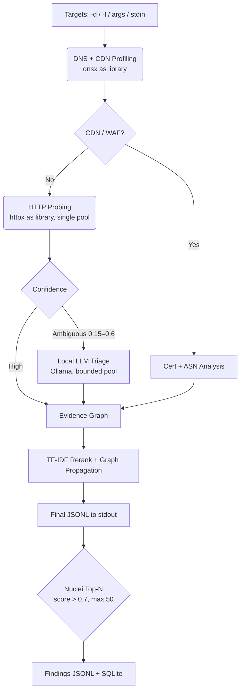

<h1 align="center">
  Rarefy
</h1>

<p align="center">
  
</p>

<p align="center">
  <a href="https://go.dev/"></a>
  <a href="https://github.com/raghavraut/rarefy/releases"></a>
  <a href="https://github.com/raghavraut/rarefy/blob/main/LICENSE"></a>
  <a href="https://goreportcard.com/report/github.com/raghavraut/rarefy"></a>
</p>

<p align="center">
  <b>Rarefy is an AI-augmented, mathematically scored Attack Surface Triage engine that replaces manual subdomain inspection with TF-IDF rarity scoring and graph correlation.</b>
</p>

<p align="center">
  <a href="#-features">Features</a> •
  <a href="#-installation">Installation</a> •
  <a href="#-usage">Usage</a> •
  <a href="#-architecture">Architecture</a> •
  <a href="#-license">License</a>
</p>

---

## ✨ Features

- 🧠 **TF-IDF Rarity Scoring** — campaign-aware IDF with stop-list suppression kills WAF/CDN false positives mathematically, not with regex blocklists.
- 🕸️ **Evidence Graph** — sharded in-memory graph correlating assets, IPs, and TLS identities; interest propagates through shared certificates.
- 🤖 **Local LLM Triage** — ambiguous band (0.15–0.6) routed to a bounded Ollama pool with a closed AppSec taxonomy; unreachable server degrades to `UNKNOWN`, never crashes.
- 🛡️ **Bounty-Safe Nuclei** — Top-N post-scan over `exposure,misconfig` tags with an `intrusive,dos,oast` denylist, sandboxed, hard-timeout bounded.
- 📊 **Visual Web UI** — single-binary embedded dashboard: click-to-inspect Mermaid graph plus sortable corpus table with band highlighting. `DOT`/`Mermaid` export included.

---

## 📦 Installation

Pick one method. All three end with `rarefy` on your `PATH` — no follow-up setup.

**Prebuilt binary** (Linux/macOS/Windows, no Go needed — recommended):

```sh
# linux amd64 example; pick your asset from
# https://github.com/raghavraut/rarefy/releases
curl -sL https://github.com/raghavraut/rarefy/releases/latest/download/rarefy_1.0.0_linux_amd64.tar.gz | tar xz
sudo mv rarefy /usr/local/bin/
rarefy --help
```

**From source:**

```sh
git clone https://github.com/raghavraut/rarefy && cd rarefy
make build && make test
sudo make install   # copies ./rarefy to /usr/local/bin
```

**Go install** (Go ≥ 1.26). Note: `go install` places the binary in
`~/go/bin`, which is *not* on `PATH` by default — finish with one of:

```sh
go install -v github.com/raghavraut/rarefy/cmd/rarefy@latest   # -v shows progress; first build takes minutes
sudo ln -s ~/go/bin/rarefy /usr/local/bin/rarefy               # option A: apt-like, works in every shell
# or: echo 'export PATH="$PATH:$HOME/go/bin"' >> ~/.zshrc      # option B (use ~/.bashrc for bash)
```

> First nuclei run needs the template bundle (`nuclei -update-templates`, or pass `--nuclei-templates DIR`). Missing bundle degrades gracefully to zero findings.

---

## 🚀 Usage

```
rarefy scan    Probe targets, score with TF-IDF rarity, stream JSONL to stdout
rarefy filter  Slice persisted verdicts by score, confidence and tech
rarefy export  Render the evidence graph (Graphviz DOT or Mermaid)
rarefy ui      Serve the local triage dashboard (graph + corpus views)
rarefy db      Inspect and manage the SQLite resume store
```

```sh
# Bring your own subdomains (amass/subfinder paste-friendly)
rarefy scan -l subs.txt --campaign target.com | tee verdicts.jsonl

# Slice the winners
rarefy filter --min-score 0.6 --format urls > top_targets.txt
rarefy filter --tech Jenkins --format jsonl

# Render + inspect
rarefy export --campaign target.com --format mermaid --out surface.mmd
rarefy ui --campaign target.com --open
```

### 🎯 Real-World Bug Bounty Pipeline

```sh
# 1. Enumerate passively
subfinder -d target.com -silent | tee subs.txt

# 2. Triage: provisional JSONL streams during probing, reranked finals after
rarefy scan -l subs.txt --campaign target.com --export-corpus corpus.json \
  | tee verdicts.jsonl

# 3. Extract high-value targets straight into nuclei
rarefy filter --campaign target.com --min-score 0.6 --format urls \
  | nuclei -tags exposure,misconfig -severity medium,high,critical

# 4. The ambiguous middle goes to human review via the dashboard
rarefy filter --campaign target.com --format markdown > triage-notes.md
rarefy ui --campaign target.com --open
```

> Contract: **stdout is strict JSONL** (verdicts + `{"type":"nuclei_finding"}` lines) for pipes; **stderr is human logs**. Interrupted 10-hour scans resume with the same `--campaign` + `--db`.

---

## 🧬 Architecture



**Scoring** — `IDF(t) = log(1 + N/(1+df(t)))` per campaign; tokens on >70% of hosts crushed ×0.1; `score = min(1, rarity + bonuses) × confidence`. SimHash clustering dedupes WAF pages; BFS propagation (decay 0.5, depth ≤ 3) flows interest through shared IPs/certs.

---

## 📄 License

MIT — see [LICENSE](LICENSE).
